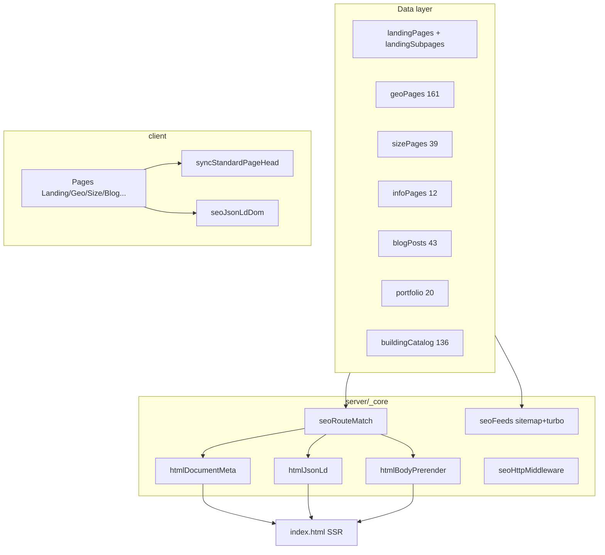

> **Архив.** Актуально: [docs/SEO/README.md](docs/SEO/README.md)

# SEO Master Plan — freonn.pro

> Изучено: **2026-06-10** · Источники: код, `pnpm seo:audit`, `keywords_yandex_direct.csv`, GSC/Metrika отчёты, prod sitemap

---

## 1. Executive summary

**Freonn.pro** — SPA (React + Wouter) с **полноценным SEO-конveyor**: динамический sitemap/turbo, SSR meta + JSON-LD + HTML-body для роботов, единый `matchSeoRoute`, geo/size/landing data-слой, автопроверки `seo:audit`.

| | Production (live) | Локально (working tree) |
|--|------------------|-------------------------|
| **Sitemap URL** | **267** | **592** |
| **GSC «обнаружено»** | ~68 (устарело) | — |
| **seo:audit** | — | PASSED |
| **Не задеплоено** | — | **~325 URL** (4 коммита ahead) |

**Главный блокер роста сейчас не «нет страниц», а:**
1. **Push + deploy** — 592 URL локально, prod ~267
2. **Индексация отстаёт** (68 vs 267 vs 592)
3. **Семантика закрыта на ~75%** (200 ключей Директа)
4. **Ops:** `SEO_CONTENT_REVISION`, Вебмастер/GSC resubmit

---

## 2. Архитектура SEO (как устроено)



**Единое правило:** новый тип URL → `seoRouteMatch` + data-файл + `seoFeeds` + `seoPagePresentation` + React page + `seoAuditChecks`.

**Ключевые файлы:**

| Файл | Роль |
|------|------|
| `server/_core/seoRouteMatch.ts` | Распознавание всех URL |
| `server/_core/seoFeeds.ts` | Sitemap + Turbo RSS |
| `server/_core/htmlDocumentMeta.ts` | Title, description, canonical, OG |
| `server/_core/htmlJsonLd.ts` | Schema.org SSR |
| `server/_core/htmlBodyPrerender.ts` | Текст для роботов (`#ssr-fallback`) |
| `shared/seoPagePresentation.ts` | Единые head для SSR и клиента |
| `shared/seoAuditChecks.ts` | Route parity, SSR, geo-price |
| `shared/seoSizes.ts` | Размеры combo/standalone |
| `shared/moSeo.ts` | MO-хаб, combo-ссылки, geo grid |
| `scripts/seo-audit.ts` | `pnpm seo:audit` |

---

## 3. Инвентарь URL (локально, 592)

| Тип | Кол-во | Примеры |
|-----|-------:|---------|
| Главная + служебные | 4 | `/`, `/blog`, `/portfolio`, `/rekvizity` |
| Landing корневые + sub | ~46 | `/angary`, `/angary/holodnye`, `/sklady/klass-a`, … |
| Geo angary | 87 | `/angary-moskva`, `/angary-podolsk`, … |
| Geo sklady | 45 | `/sklady-moskva`, … |
| Geo proizvodstvo | 40 | `/proizvodstvennye-zdaniya-moskva`, … |
| Size (standalone + combo) | 135 | `/angar-1000-m2`, `/angar-1000-m2-podolsk`, … |
| MO-хаб | 1 | `/moskovskaya-oblast` |
| Info / услуги | 12 | `/tseny`, `/proektirovanie`, `/garantii`, … |
| Portfolio | 21 | `/portfolio/...` |
| Блог | 73 | `/blog/...` (MO long-tail: 13) |
| Каталог `/zdaniya` | 137 | хаб + 136 типов калькулятора |

**MO-first:** tier-модель в `shared/seoRegionTier.ts`, combo Tier1 `*-m2-{city}` (~96 URL). Стратегия: `SEO_MOSCOW_FIRST.md`.

**Turbo RSS:** 588 items (лимит 1000 — OK).

---

## 4. Покрытие 200 ключей Я.Директ

| Группа | Ключей | Покрытие | Целевые URL | Пробел |
|--------|-------:|----------|-------------|--------|
| 1 Ангары общие | 15 | **80%** | `/angary`, sub holodnye/teplye | sendvich, bystrovozvodimye — нет sub |
| 2 Ангары размеры | 15 | **100%** | `/angar-{N}-m2` | габариты 20×40 — нет |
| 3 Ангары города | 15 | **100%** | geo 52+ городов | — |
| 4 Склады | 20 | **85%** | `/sklady`, sub, size, geo | holodilny, logisticheskie, sendvich |
| 5 Производство | 15 | **75%** | landing, sub s-kranom/legkoe, size | sendvich, zavod |
| 6 С/х | 15 | **40%** | `/selskokhozyaystvennye-zdaniya` | zernokhranilishche, korovnik — нет sub |
| 7 Торговые | 10 | **70%** | `/torgovye-zdaniya` | sub: magazin, paviljon |
| 8 Спорт | 10 | **60%** | `/sportivnye-sooruzheniya` | sub: manezh, basseyn |
| 9 Металлоконструкции | 15 | **50%** | `/montazh`, `/zdaniya/*` | нет хаба `/metallokonstruktsii` |
| 10 Сэндвич-панели | 10 | **30%** | упоминания в FAQ | нет landing |
| 11 Быстровозводимые | 10 | **40%** | блог | нет landing |
| 12 Навесы | 11 | **20%** | тип в `/zdaniya` | нет landing |
| 13 Проектирование | 12 | **90%** | `/proektirovanie`, калькулятор | — |
| 14 Фундамент/инж. | 10 | **40%** | FAQ на landing | нет отдельных URL |
| 15 Коммерческие | 10 | **80%** | landing + geo | — |
| 16 Доп. услуги | 10 | **70%** | `/tseny`, `/dostavka` | uтепление, vorota — в FAQ |

**Итого семантическое покрытие: ~55–60%** ключей имеют прямой URL; остальное — через блог, FAQ или не покрыто.

---

## 5. Сильные стороны

- SSR meta + JSON-LD + body на всех типах страниц
- Единый matcher и audit — нет «осиротевших» URL в sitemap
- Geo с согласованными ₽/m² (`geoRubM2Value`)
- MO-кластер: хаб + 36 городов × 3 типа (частично)
- Size long-tail: angar 200–10 000 + sklad/tsekh 500–5000 + combo Москва
- E-E-A-T: garantii, litsenzii, o-kompanii, portfolio, rekvizity
- Analytics: Metrika + GA4 + SPA hit + цели lead
- robots.txt: Host, Clean-param, turbo sitemap

---

## 6. Слабые стороны и риски

| Проблема | Влияние | Приоритет |
|----------|---------|-----------|
| **165 URL не в prod** | Деньги SEO не работают | **P0** |
| GSC 68 / prod 267 / local 432 | Недоиндексация | **P0** |
| `seo:audit` не в CI | Регрессии при merge | P1 |
| OG один `/og-image.jpg` | Низкий CTR в соцсетях/мессенджерах | P1 |
| Header без sub/geo/size | Слабая перелинковка | P1 |
| 9 MO-городов без sklad geo | Дыры в кластере МО | P2 |
| Turbo 428 items — лимит 1000 | OK пока, следить | P2 |
| Нет `blog_drafts.md` / контент-плана | Блог растёт хаотично | P2 |
| Отзывы Person в JSON-LD — заглушки | E-E-A-T | P3 (данные) |
| framer-motion на landing | LCP/INP | P3 |

---

## 7. Фазы roadmap

### Фаза A — Deploy & Index (1–2 недели) 🔴

**Цель:** вывести 432 URL в production и запустить индексацию.

- [ ] **A1.** Commit + push всех SEO-изменений (subpages, size expansion, geo sync, seoSizes)
- [ ] **A2.** Deploy Railway/production
- [ ] **A3.** `SEO_CONTENT_REVISION=2026-06-10` в `.env` production
- [ ] **A4.** Smoke после деплоя:
  - `curl https://freonn.pro/sitemap.xml` → count ≥ 430
  - `curl https://freonn.pro/angary/holodnye` → нет `<!--SSR_BODY-->`, есть `ld-ssr-page`
  - `curl -I https://freonn.pro/nonexistent` → 404
- [ ] **A5.** Яндекс.Вебмастер: переобход sitemap + turbo; проверить Host
- [ ] **A6.** GSC: resubmit sitemap, запрос индексации топ-20 URL
- [ ] **A7.** Добавить `pnpm seo:audit` в `.github/workflows/ci.yml`

**KPI фазы:** prod sitemap = 432; через 14 дней GSC «обнаружено» > 200.

---

### Фаза B — Семантика P1 (2–4 недели)

**Цель:** +40–60 URL, покрытие ключей → 75%.

#### B1. Новые landing-хабы (4 × ~3 sub = +16 URL)

| URL | Группа ключей |
|-----|---------------|
| `/bystrovozvodimye-zdaniya` | 141–150 |
| `/sendvich-paneli` | 131–140 |
| `/metallokonstruktsii` | 116–130 |
| `/navesy` | 151–161 |

#### B2. Sub landing (ещё +12 URL)

```
/angary/sendvich-paneli, /angary/bystrovozvodimye
/sklady/holodilnye, /sklady/logisticheskie, /sklady/sendvich-paneli
/selskokhozyaystvennye-zdaniya/zernokhranilishche, /korovnik, /ptichnik
/proizvodstvennye-zdaniya/sendvich-paneli
/torgovye-zdaniya/magazin, /sportivnye-sooruzheniya/manezh
```

#### B3. Geo gaps MO (+11 URL)

Sklad для 9 городов без sklad: ramenskoye, pushkino, serpukhov, dolgoprudny, lobnya, istra, klin, zhukovsky, stupino.  
Proizvodstvo: klin, volokolamsk.

#### B4. Size габариты (+6 URL)

`/angar-20x40-m2`, `/angar-24x60-m2`, `/angar-30x60-m2`, `/angar-12x24-m2`, `/angar-15x30-m2`, `/angar-18x36-m2`

**KPI фазы:** sitemap ~500 URL; семантика 75%.

---

### Фаза C — Контент & E-E-A-T (1–2 месяца)

- [ ] **C1.** Блог: 60+ статей (сейчас 43) — 1 статья / 3 дня по `keywords_yandex_direct.md`
- [ ] **C2.** `blog_drafts.md` — очередь из 30 тем с привязкой к URL
- [ ] **C3.** FAQ 8–12 на каждом root landing (часть уже есть)
- [ ] **C4.** Уникальный intro на geo Tier 1 (не копия angary-шаблона)
- [ ] **C5.** Portfolio: фото объектов + alt + привязка к geo/size
- [ ] **C6.** Отзывы: реальные Person JSON-LD (ждёт владельца)
- [ ] **C7.** `/litsenzii`: сканы СРО когда будут

**KPI:** +17 статей; 5 portfolio с фото; 3 отзыва с Person.

---

### Фаза D — UX SEO & конверсия (2–3 недели)

- [ ] **D1.** Header mega-menu: subtypes angary/sklady + MO hub + size 1000/2000
- [ ] **D2.** Footer: классы складов, холодные/тёплые, `/komanda`
- [ ] **D3.** Блок «Подтипы» на parent landing (`landingSubpagesForParent`)
- [ ] **D4.** OG-изображения по кластеру (6 WebP: angary, sklad, prod, geo, size, blog)
- [ ] **D5.** Metrika цели: `seo_landing_view`, `seo_geo_view`, `seo_size_view`
- [ ] **D6.** SeeAlso расширить на sub-landing

---

### Фаза E — Мониторинг & off-page (ongoing)

- [ ] **E1.** Еженедельно: GSC impressions/clicks по 20 контрольным запросам
- [ ] **E2.** Ежемесячно: `pnpm seo:audit` + diff sitemap count
- [ ] **E3.** Turbo split при >900 items: `turbo-geo.xml`, `turbo-blog.xml`
- [ ] **E4.** Я.Бизнес URL в `sameAs` Organization
- [ ] **E5.** Дашборд Metrika: органика по landing/geo/size/blog
- [ ] **E6.** Директ: minus-words на дубли SEO URL

**20 контрольных запросов:**

1. строительство ангара под ключ  
2. ангар 1000 м2 под ключ цена  
3. строительство склада под ключ  
4. холодный склад под ключ  
5. тёплый склад под ключ  
6. строительство ангаров в москве под ключ  
7. склады подольск / ангары химки  
8. строительство производственного здания под ключ  
9. быстровозводимые здания под ключ  
10. ангар из сэндвич панелей под ключ  
11. строительство склада 2000 м2  
12. логистический склад строительство  
13. проектирование ангара  
14. монтаж металлоконструкций цена  
15. зернохранилище под ключ  
16. строительство зданий московская область  
17. металлический ангар под ключ цена  
18. склад класса a  
19. цех из металлоконструкций  
20. навес из металлоконструкций под ключ  

---

## 8. Sprint backlog (ближайшие 14 дней)

| День | Задача | Результат |
|------|--------|-----------|
| 1 | Commit + deploy фазы A | 432 URL live |
| 1 | SEO_CONTENT_REVISION + Вебмастер | lastmod, переобход |
| 2 | seo:audit в CI | регрессии ловятся |
| 3–4 | `/bystrovozvodimye-zdaniya` + 2 sub | +3 URL |
| 5–6 | `/sklady/holodilnye`, `/logisticheskie` | +2 URL |
| 7–8 | `/selskokhozyaystvennye-zdaniya/zernokhranilishche`, `/korovnik` | +2 URL |
| 9–10 | 11 sklad geo MO gaps | +11 URL |
| 11–12 | 5 статей блога (MO, size, holodny/teply) | +5 URL |
| 13 | OG WebP × 6 кластеров | CTR соцсети |
| 14 | Header subtypes + отчёт GSC | перелинковка |

---

## 9. Целевые метрики (6 месяцев)

| KPI | Сейчас (prod) | 1 мес | 3 мес | 6 мес |
|-----|---------------|-------|-------|-------|
| Sitemap URL | 267 | 432 | 500 | 580 |
| GSC indexed | ~68 | 250 | 400 | 500 |
| Органика визиты/мес | baseline* | +15% | +30% | +50% |
| Топ-10 Яндекс (20 запросов) | ? | 3 | 6 | 10 |
| seo:audit errors | 0 local | 0 | 0 | 0 |
| LCP mobile landing | ? | <3s | <2.5s | <2.5s |
| Lead из organic (Metrika) | baseline* | +10% | +25% | +40% |

*baseline — снять из Metrika после deploy фазы A

---

## 10. Что НЕ делаем

- Массовые thin geo (1000+ городов с одним абзацем)
- Combo geo×size для всех городов без трафика в Метрике
- Отдельный URL на каждый из 200 ключей Директа
- Дубли title без ₽/m² на geo
- Turbo без SSR-body
- Force-index spam в GSC

---

## 11. Зависимости от владельца

- [ ] Реальные отзывы (имя, должность, компания)
- [ ] Фото 20 объектов portfolio
- [ ] Сканы СРО / лицензий
- [ ] URL Я.Карт / Я.Бизнес для JSON-LD `sameAs`
- [ ] Baseline органики из Metrika (экспорт за 90 дней)
- [ ] Решение юриста: маркетинговое согласие

---

## 12. Чеклист релиза SEO

```bash
pnpm seo:audit          # 0 errors
pnpm check && pnpm build
git commit && git push
# deploy
# production .env: SEO_CONTENT_REVISION=YYYY-MM-DD
curl -s https://freonn.pro/sitemap.xml | grep -c '<loc>'
curl -s https://freonn.pro/angary/holodnye | grep ld-ssr-page
# Яндекс.Вебмастер → Переобход
# GSC → Sitemaps → Resubmit
```

---

## 13. Статус задач (сводка)

### ✅ Сделано (инфра + контент)

- [x] Sitemap + turbo динамические (**592 URL** локально)
- [x] SSR meta, JSON-LD, body
- [x] seoRouteMatch, seoHttpMiddleware, **seo:audit в CI**
- [x] 10 landing root + **36 sub** (niche + extra)
- [x] **172 geo**, **135 size** (combo MO Tier1, габариты)
- [x] MO-first tier (`seoRegionTier`), combo `*-m2-{city}` (~96 URL)
- [x] 12 info/услуг, **portfolio 21** (cover + geo alt), **blog 73**
- [x] `/zdaniya` 136 типов, MO hub
- [x] SeeAlso (в т.ч. sub-landing), geo price sync
- [x] Header/Footer deep links, блок «Подтипы», OG по кластерам
- [x] Metrika goals: `seo_landing_view`, `seo_geo_view`, `seo_size_view`

- [x] **`blog_drafts.md` закрыт (34/34)**

### 🔴 P0 — deploy (только ops)

- [ ] **`git push`** (4+ коммита ahead; `gh auth login`)
- [ ] `SEO_CONTENT_REVISION=2026-06-20` в production `.env`
- [ ] Deploy Railway/production
- [ ] Яндекс.Вебмастер + GSC: resubmit sitemap/turbo
- [ ] Smoke: prod sitemap ≥ 590, SSR на `/angar-1000-m2-podolsk`

### 🟡 P1 — после deploy

- [ ] Metrika: дашборд органики по кластерам (E5)
- [ ] GSC: 20 контрольных запросов — weekly report
- [ ] Baseline органики из Metrika (90 дней)

### 🟢 P2–P3 — далее

- [ ] Turbo split при >900 URL
- [ ] Реальные отзывы / Person JSON-LD (ждёт владельца)
- [ ] LCP: lazy framer-motion
- [ ] Portfolio: реальные фото объектов (ждёт владельца)

---

*Документ обновлять после каждого SEO-релиза: дата, sitemap count, GSC indexed.*
